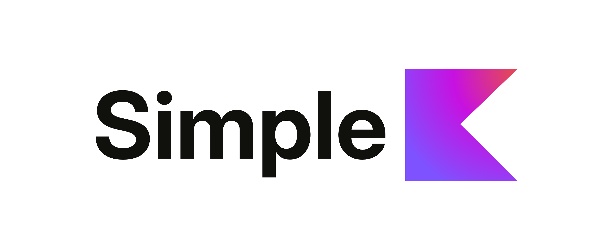

<p align="center">
  
</p>

<h1 align="center">SimpleK</h1>

<p align="center">
  <a href="https://kotlinlang.org"></a>
  <a href="https://www.jetbrains.com/lp/compose-multiplatform/"></a>
  <a href="LICENSE"></a>
  <a href="https://github.com/sigmadeltasoftware/simplek"></a>
</p>

<p align="center">
  <em>A smooth, animated Kanban board library for Compose Multiplatform.<br/>
  Build beautiful, interactive task boards with drag-and-drop support, zoom-out navigation, and customizable themes.</em>
</p>

---

https://github.com/user-attachments/assets/d48fc6ab-688a-41b1-9696-d29461a66ad7

## Features

- **Drag & Drop Cards**: Long-press to pick up cards and drag them between columns
- **Zoom-Out Navigation**: Drag cards outside their column to see a miniature overview of all columns
- **Smooth Animations**: Built-in animations for card movements, column transitions, and zoom effects
- **Haptic Feedback**: Native haptic feedback on iOS and Android for drag interactions
- **Customizable Themes**: Light and dark themes with full color customization
- **DSL Builder**: Declarative Kotlin DSL for building boards
- **Type-Safe**: Generic card types with full type safety

## Supported Platforms

| Platform | Status |
|----------|--------|
| Android | ✅ Supported |
| iOS | ✅ Supported |
| Desktop (JVM) | ✅ Supported |

## Installation

Add the dependency to your module's `build.gradle.kts`:

```kotlin
dependencies {
    implementation("be.sigmadelta.simplek:simplek:1.0.0-2.2.20")
}
```

> Note: The version format is `{libraryVersion}-{kotlinVersion}`.

## Quick Start

### Basic Usage

```kotlin
@Composable
fun MySimpleKBoard() {
    // Create the board state
    val board = remember {
        simpleKBoard {
            column("To Do") {
                card("Design homepage", "Create wireframes")
                card("Setup CI/CD")
            }
            column("In Progress", maxItems = 3) {
                card("Implement login")
            }
            column("Done") {
                card("Project setup")
            }
        }
    }

    val state = rememberSimpleKState(board)

    // Render the board
    SimpleKBoard(
        state = state,
        cardContent = { card ->
            // Custom card UI
            Card(modifier = Modifier.fillMaxWidth()) {
                Column(modifier = Modifier.padding(12.dp)) {
                    Text(card.title, fontWeight = FontWeight.Bold)
                    card.description?.let { Text(it, fontSize = 12.sp) }
                }
            }
        }
    )
}
```

### Custom Card Types

You can use your own data types by implementing `SimpleKItem`:

```kotlin
data class Task(
    override val id: SimpleKId,
    val title: String,
    val assignee: String?,
    val priority: Priority,
    val dueDate: LocalDate?,
) : SimpleKItem

enum class Priority { LOW, MEDIUM, HIGH }
```

Then create a board with your custom type:

```kotlin
val initialBoard = SimpleKBoard(
    id = SimpleKId.generate(),
    columns = listOf(
        SimpleKColumn(
            id = SimpleKId.generate(),
            title = "Backlog",
            items = listOf(
                Task(SimpleKId.generate(), "Task 1", "Alice", Priority.HIGH, null),
                Task(SimpleKId.generate(), "Task 2", null, Priority.LOW, LocalDate.now()),
            )
        ),
        // ... more columns
    )
)

val state = rememberSimpleKState(initialBoard)
```

### Event Callbacks

Handle board events using the `SimpleKCallbacks` wrapper:

```kotlin
SimpleKBoard(
    state = state,
    callbacks = SimpleKCallbacks(
        onCardMoved = { cardId, fromCol, toCol, fromIdx, toIdx ->
            // Persist to database
            database.updateCardPosition(cardId, toCol, toIdx)
        },
        onCardClick = { card ->
            // Show card details
            navController.navigate("card/${card.id}")
        },
        onDragStart = { card -> /* Analytics, UI feedback */ },
        onDragEnd = { card, cancelled -> /* Cleanup */ },
        canMoveCard = { cardId, toColumnId ->
            // Validate WIP limits
            getColumnCardCount(toColumnId) < 5
        },
    ),
    cardContent = { card -> /* ... */ }
)
```

Or use the builder DSL:

```kotlin
SimpleKBoard(
    state = state,
    callbacks = simpleKCallbacks {
        onCardMoved { cardId, fromCol, toCol, fromIdx, toIdx ->
            saveToDatabase(cardId, toCol, toIdx)
        }
        onCardClick { card -> showDetails(card) }
    },
    cardContent = { card -> /* ... */ }
)
```

### Configuration

Customize board appearance and behavior with `SimpleKConfig`:

```kotlin
SimpleKBoard(
    state = state,
    config = SimpleKConfig(
        columnWidth = 300.dp,
        columnSpacing = 16.dp,
        cardSpacing = 8.dp,
        enableZoomOutDrag = true,
        zoomOutDurationMillis = 800L,
        overlayTheme = OverlayTheme.Dark,
        boardTheme = BoardTheme.Dark,
    ),
    cardContent = { card -> /* ... */ }
)
```

Available configuration options:

| Option | Type | Default | Description |
|--------|------|---------|-------------|
| `columnWidth` | `Dp` | `280.dp` | Width of each column |
| `columnSpacing` | `Dp` | `12.dp` | Horizontal spacing between columns |
| `cardSpacing` | `Dp` | `8.dp` | Vertical spacing between cards |
| `enableCardDrag` | `Boolean` | `true` | Enable/disable card dragging |
| `enableZoomOutDrag` | `Boolean` | `true` | Enable zoom-out when dragging outside column |
| `zoomOutDurationMillis` | `Long` | `800L` | Duration of zoom-out animation |
| `zoomInDurationMillis` | `Long` | `400L` | Duration of zoom-in animation |
| `overlayTheme` | `OverlayTheme` | `Light` | Theme for the zoom-out overlay |
| `boardTheme` | `BoardTheme` | `Light` | Theme for the main board |

### State Management

The `SimpleKState` object provides methods to programmatically modify the board:

```kotlin
// Move a card to a new position
state.moveCard(
    cardId = cardId,
    toColumnId = targetColumnId,
    toIndex = 0
)

// Add a new card
state.addCard(
    columnId = columnId,
    card = newCard,
    index = 0 // Optional, defaults to end
)

// Remove a card
state.removeCard(columnId, cardId)

// Add a column
state.addColumn(
    column = SimpleKColumn(
        id = SimpleKId.generate(),
        title = "Review",
        items = emptyList()
    ),
    index = 2 // Optional
)

// Remove a column
state.removeColumn(columnId)

// Move a column
state.moveColumn(fromIndex = 0, toIndex = 2)

// Access current board state
val currentBoard = state.board

// Check drag state
val isDragging by state.isDragging
```

### Theming

#### Board Theme

Control the main board colors:

```kotlin
val customBoardTheme = BoardTheme(
    columnBackground = Color(0xFFF5F5F5),
    columnBackgroundDragTarget = Color(0xFF6366F1),
    cardBackground = Color.White,
    chevronColor = Color(0xFF9CA3AF),
    accentColor = Color(0xFF6366F1),
)
```

#### Overlay Theme

Control the zoom-out overlay appearance:

```kotlin
val customOverlayTheme = OverlayTheme(
    scrimColor = Color.White,
    scrimAlpha = 0.65f,
    cardBackground = Color.White,
    cardBorder = Color(0xFFE0E0E0),
    cardBorderHovered = Color(0xFF6366F1),
    titleColor = Color(0xFF374151),
    glowColor = Color(0xFF6366F1),
    // ... more options
)
```

Built-in themes: `BoardTheme.Light`, `BoardTheme.Dark`, `OverlayTheme.Light`, `OverlayTheme.Dark`

## API Reference

### Core Components

| Component | Description |
|-----------|-------------|
| `SimpleKBoard` | Main composable for rendering the board |
| `SimpleKState` | State holder for board data and drag operations |
| `rememberSimpleKState` | Composable function to create and remember state |
| `SimpleKConfig` | Configuration data class for customization |
| `SimpleKCallbacks` | Event callbacks wrapper (onCardMoved, onCardClick, etc.) |

### Data Models

| Model | Description |
|-------|-------------|
| `SimpleKBoard<T>` | Represents the entire board with columns |
| `SimpleKColumn<T>` | A column containing cards |
| `SimpleKItem` | Interface for card data (implement this for custom types) |
| `SimpleKId` | Unique identifier (value class) |
| `DefaultCard` | Built-in card type with title, description, labels, etc. |

### DSL Functions

| Function | Description |
|----------|-------------|
| `simpleKBoard { }` | Create a board with DSL |
| `column("title") { }` | Add a column to the board |
| `card("title", "description")` | Add a card to a column |

## Demo App

Check out the `demo` module for a complete example with:
- Theme switching (light/dark)
- Collapsible sidebar
- Sample task cards with priorities and labels
- Both portrait and landscape layouts

## License

SimpleK is available under the Sigma Delta License. Key terms:

1. **Free to use** - Use, modify, and distribute freely
2. **In-app attribution required** - Must credit "Sigma Delta" visibly in your app (e.g., About screen, credits)
3. **Marketing rights** - Sigma Delta may reference your app as a user of SimpleK

See [LICENSE](LICENSE) for full terms.
